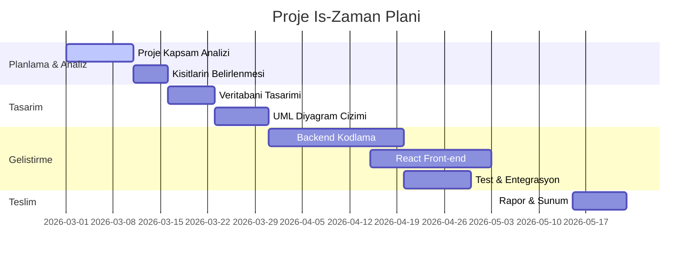

# Şifa Polikliniği Bilgi Sistemi - Proje Yönetim Raporu

Bu rapor, "Şifa Polikliniği Bilgi Sistemi" (ŞPYS) yazılım projesinin kapsamını, fizibilite çalışmasını, kabul/kısıt kriterlerini, risk analizlerini, nesneye yönelik tasarım prensiplerini, sınıf düzeyinde izlenebilirlik matrisini, birim testlerin sınama raporlarını ve ekip organizasyonunu tanımlayan resmi proje yönetim belgesidir.

---

## 1. Proje Alan Tanımı ve Kapsamı

Şifa Polikliniği Bilgi Sistemi, poliklinik ortamında hastaların başvurusundan ödeme ve taburcu işlemlerine kadar geçen tüm süreçleri dijitalleştirmeyi amaçlayan kapsamlı bir otomasyon yazılımıdır. 

### Projenin Kapsamı:
*   **Hasta Kayıt Modülü:** Yeni hastaların T.C. Kimlik numarası kontrolüyle sisteme kaydedilmesi, kayıtlı hastalar arasında isim, soyisim veya T.C. Kimlik no ile arama yapılması ve hasta bilgilerinin güncellenmesi.
*   **Randevu Yönetim Modülü (MHRS Grid Yapısı):** Seçilen poliklinik ve doktor bazında 30 dakikalık zaman dilimlerine bölünmüş uygunluk tablosunun listelenmesi. Randevu alma, randevu sorgulama ve randevu iptal mekanizmalarının işletilmesi.
*   **Doktor Muayene Modülü:** Muayene sırası bekleyen hastaların listelenmesi, hekim tarafından hasta geçmiş vizite kayıtlarının geriye dönük incelenmesi, tanı/teşhis ve tedavi notlarının girilmesi, reçete ve rapor gibi klinik dökümanların sisteme yüklenmesi.
*   **Vezne ve Fatura Modülü:** Hekim muayenesini tamamlamış hastaların vizite kayıtlarının listelenmesi, tedavi hizmet kataloğuna bağlı kalınarak fatura kalemlerinin oluşturulması, hastanın T.C. Kimlik numarasına göre SGK/Özel Sigorta indirim oranlarının sorgulanması (Mock servis ile) ve nakit/kart seçenekleriyle ödeme tahsilatı.
*   **Admin Yönetim Paneli:** Sisteme yeni kullanıcı (Doktor, Veznedar, Kayıt Personeli) eklenmesi, kullanıcı bilgilerinin güncellenmesi ve pasife alınması. Poliklinik ve klinik tanımlamalarının yapılması (hekim bağlı olmayan kliniklerin silinmesi, klinik adlarının güncellenmesi). Sistemdeki randevuların belirli tarih aralıklarında filtrelenerek sayfalama yapısıyla ekranda raporlanması ve PDF olarak indirilmesi.

### Fizibilite Çalışması (Feasibility Analysis):
*   **Teknik Yapılabilirlik:** Projede Spring Boot (Java 21) ve React (TypeScript) gibi endüstri standardı ve güçlü topluluk desteğine sahip teknolojiler seçilmiştir. Katmanlı mimari yapısı ve JPA/PostgreSQL kullanımı sayesinde veritabanı tutarlılığı en üst düzeydedir.
*   **Ekonomik Yapılabilirlik:** Sistem tamamen açık kaynaklı teknolojiler (PostgreSQL, Java, React, Docker) üzerine inşa edildiğinden lisans maliyeti sıfırdır. Bulut sunucularda düşük kaynak tüketimi ile çalışabilecek şekilde optimize edilmiştir.
*   **Operasyonel Yapılabilirlik:** Arayüz MHRS benzeri alışılagelmiş bir yapıda tasarlandığı için kayıt görevlisi, doktor ve veznedar gibi personellerin ekstra bir eğitime ihtiyaç duymadan sistemi kolayca kullanabilmesi hedeflenmiştir.

---

## 2. Kabul Kriterleri ve Kısıtlar

### Kabul Kriterleri:
1.  **Rol Tabanlı Yetkilendirme (RBAC):** Sistemde `ADMIN`, `REGISTRATION_CLERK` (Kayıt Görevlisi), `APPOINTMENT_CLERK` (Randevu Görevlisi), `DOCTOR` ve `CASHIER` (Veznedar) olmak üzere 5 rol bulunmalı ve her rol yalnızca kendi ekranlarına erişebilmelidir.
2.  **Randevu Kural Seti:** Randevu saatleri 09:00 - 17:00 saatleri arasında, 30 dakikalık periyotlarda olmalıdır. 12:00 - 13:00 saatleri arası öğle arası olup randevu verilememelidir. Hafta sonu günlerinde randevu planlanamamalıdır.
3.  **Hekim-Klinik İlişkisi:** Bir klinik ancak altında aktif çalışan bir doktor bulunmadığı takdirde silinebilir. Geçmiş muayene kayıtlarının tutarlılığı için bu durum kontrol altında tutulmalıdır.
4.  **Güvenlik:** Kullanıcı şifreleri veritabanında BCrypt algoritması ile şifrelenmiş olarak saklanmalı, API istekleri JWT (JSON Web Token) ile korunmalıdır.

### Kısıtlar:
1.  **Tek Lokasyon Varsayımı:** Poliklinik tek bir fiziksel merkezde hizmet vermektedir; çoklu şube veya tele-tıp entegrasyonu kapsam dışıdır.
2.  **Mock Sigorta Sorgulama:** SGK veya özel sigorta şirketlerinin canlı sistemleriyle doğrudan entegrasyon yerine, T.C. Kimlik numarasının son hanesine göre deterministik çalışan bir mock (stub) servis kullanılacaktır.
3.  **Zaman Dilimi:** Randevu planlama ve döküman zaman damgaları Türkiye yerel saati (`Europe/Istanbul`, UTC+3) temel alınarak işletilmelidir.

---

## 3. Risk Tablosu

Proje geliştirme sürecinde karşılaşılabilecek olası riskler, olasılık/etki dereceleri ve bunlara karşı geliştirilen eylem planları aşağıda listelenmiştir:

| Risk No | Risk Tanımı | Türü | Olasılık | Etki | Eylem Planı (Mitigation Strategy) |
| :--- | :--- | :--- | :---: | :---: | :--- |
| **R1** | Eş zamanlı randevu isteklerinde çakışma yaşanması (Race Condition) | Teknik | Orta | Yüksek | Veritabanı seviyesinde `uk_doctor_slot` kısıtı (Unique Constraint) uygulanarak mükerrer kayıtlar engellenir. |
| **R2** | Kullanıcı silindiğinde ilişkili muayene verilerinin kaybolması | Teknik | Düşük | Çok Yüksek | Kullanıcılar fiziksel olarak silinmek yerine "active = false" durumuna getirilerek soft-delete mantığıyla arşivlenir. |
| **R3** | Veritabanı bağlantı kopması veya veri kaybı | Proje | Düşük | Çok Yüksek | Dockerize edilmiş PostgreSQL veritabanı için günlük otomatik yedekleme (backup) scriptleri kurulur. |
| **R4** | API sorgularında yavaşlama ve performans kaybı | Teknik | Orta | Orta | Hasta arama, fatura takibi ve raporlama gibi listeleme ekranlarında Spring Boot ve React tarafında sayfalama (Pagination) zorunlu kılınır. |
| **R5** | Mock sigorta servisinde ağ gecikmesi veya hata oluşması | Teknik | Orta | Düşük | Hatalı veya geçersiz T.C. durumunda sigorta indirimi uygulanmadan doğrudan brüt tutar tahsilatına izin veren yedek mekanizma kurulur. |
| **R6** | Hekim ekranında detay modal pencerelerinin kayması (UI Kayması) | Teknik | Orta | Düşük | Geçmiş sağlık kayıtları görüntüleme pencereleri React Portal yapısı kullanılarak DOM hiyerarşisinin en üstüne taşınır ve sabitlenir. |
| **R7** | Randevu iptal edilince veritabanı kısıtlarının takılması (FK Hatası) | Teknik | Orta | Yüksek | Randevu iptal edildiğinde bağlı vizite, döküman ve faturalar için veritabanında `ON DELETE CASCADE` tetikleyicisi etkinleştirilir. |
| **R8** | Ekip üyelerinin görev tesliminde gecikme yaşaması | Proje | Orta | Orta | Haftalık Scrum toplantıları ve Jira/Trello benzeri iş takip araçlarıyla görev durumları sürekli güncellenir. |

---

## 4. Proje İş-Zaman Çizelgesi (Zaman Planı)

Bazı PDF ve Markdown render motorlarının Mermaid `gantt` modülünü desteklememesi veya hatalı yorumlaması riski nedeniyle, projenin 12 haftalık zaman çizelgesi hem garantili çalışan bir Gantt şeması hem de detaylı bir takvim tablosu olarak sunulmuştur.

### A. Proje Takvimi Gantt Şeması


### B. Proje İş Paketi Takvimi

| İş Paketi | Başlangıç | Bitiş | Süre | Sorumlular | Açıklama |
| :--- | :---: | :---: | :---: | :--- | :--- |
| **Analiz & Gereksinim Belirleme** | 01.03.2026 | 15.03.2026 | 14 Gün | Tüm Ekip | Proje kapsamının belirlenmesi, kısıtların yazılması |
| **Veritabanı Şeması Tasarımı** | 16.03.2026 | 22.03.2026 | 7 Gün | Ömerhan, İsa | PostgreSQL şema tasarımı, Flyway migration planı |
| **Backend & API Geliştirme** | 23.03.2026 | 10.04.2026 | 19 Gün | İsa, Ömerhan | Spring Boot servisleri ve REST denetleyicilerin yazımı |
| **Frontend Geliştirme** | 11.04.2026 | 28.04.2026 | 18 Gün | Emre, Yılmaz | React sayfaları, MHRS Grid arayüzü ve entegrasyon |
| **Birim Testleri & Sınama** | 29.04.2026 | 10.05.2026 | 12 Gün | Yılmaz, İsa, Ömerhan | JUnit test senaryolarının koşulması ve hata ayıklama |
| **Raporlama & Proje Teslimi** | 11.05.2026 | 22.05.2026 | 12 Gün | Tüm Ekip | Proje raporu, UML diyagram çizimleri ve teslim paketi |

---

## 5. Sınıf Düzeyinde İzlenebilirlik Tablosu (Traceability Matrix)

Yazılım gereksinimleri (G1-G9) ile bu gereksinimleri karşılayan veritabanı entity'leri ve servis sınıfları (B1-B10) arasındaki ilişkiyi gösteren izlenebilirlik tablosudur.

### Kod Sınıfları Eşleşmesi:
*   **B1:** `AppUser` / `AppUserRepository`
*   **B2:** `Clinic` / `ClinicRepository`
*   **B3:** `Doctor` / `DoctorRepository`
*   **B4:** `Patient` / `PatientRepository` / `PatientService`
*   **B5:** `Appointment` / `AppointmentRepository` / `AppointmentService`
*   **B6:** `AvailabilityService`
*   **B7:** `VisitRecord` / `VisitRecordRepository` / `VisitService`
*   **B8:** `BillingLine` / `BillingLineRepository` / `BillingService`
*   **B9:** `Payment` / `PaymentRepository` / `PaymentService`
*   **B10:** `InsuranceMockService`

| Gereksinim No (G) | Gereksinim Açıklaması | B1 | B2 | B3 | B4 | B5 | B6 | B7 | B8 | B9 | B10 |
| :--- | :--- | :---: | :---: | :---: | :---: | :---: | :---: | :---: | :---: | :---: | :---: |
| **G1** | Dinamik Klinikler (Klinik CRUD) | | X | | | | | | | | |
| **G2** | Hekim-Klinik İlişkisi ve 30 Dk Slotları | | X | X | | X | X | | | | |
| **G3** | Kayıt Görevlisi Hasta Kayıt ve Arama | X | | | X | | | | | | |
| **G4** | Randevu Alma ve Alternatif Tarih Önerisi | | | X | X | X | X | | | | |
| **G5** | Kayıtsız Hastanın Kayda Aktarılması | | | | X | X | | | | | |
| **G6** | Doktor Muayene, Teşhis Girişi & Belgeler | | | X | X | X | | X | | | |
| **G7** | Vezne Fatura Sorgulama ve Kalem Ekleme | | | | X | X | | X | X | X | |
| **G8** | SGK Sigorta Sorgulama ve İndirim Uygulama | | | | | | | | | X | X |
| **G9** | Ödeme Yöntemi Sınırı (Nakit/Kart) | | | | | | | | | X | |

---

## 6. Nesneye Yönelik Tasarım Prensipleri ve Kalıpları

### Düşük Bağlaşım (Low Coupling) & Yüksek Uyum (High Cohesion):
*   **Düşük Bağlaşım (Low Coupling):** Sınıflar arası bağımlılıklar arayüzler (JPA Repositories) ve Spring'in Dependency Injection (Bağımlılık Enjeksiyonu) mekanizması ile en aza indirilmiştir. Örneğin, `PaymentService` veritabanı işlemlerini doğrudan yapmaz; `PaymentRepository` arayüzü üzerinden soyutlayarak yürütür. Sınıflar birbirlerinin iç yapılarından habersizdir.
*   **Yüksek Uyum (High Cohesion):** Her sınıf yalnızca kendi sorumluluk alanındaki işleri yapar. Örneğin, `PatientService` sadece hasta CRUD ve doğrulama mantığını yönetirken, randevu saatlerinin uygunluk kontrolü tamamen `AvailabilityService` sınıfına delege edilmiştir.

### Model-View-Controller (MVC) Tasarım Kalıbı:
Sistem, web yığınında MVC mimarisini uygulamaktadır:
*   **Model:** Domain entity'leri (`Patient`, `Appointment`, `Payment` vb.) veritabanındaki şemayı ve iş nesnelerini temsil eder.
*   **View:** React + TypeScript ile yazılmış olan web arayüzü, kullanıcının veri ile etkileşime girdiği görsel katmandır.
*   **Controller:** Spring Boot `@RestController` sınıfları (`PatientController`, `AppointmentController` vb.), View katmanından gelen HTTP isteklerini karşılar, doğrular ve ilgili Service katmanına yönlendirir.

---

## 7. Ekip Organizasyonu & Görev Dağılımı

### Ekip Yapısı ve Rol Dağılımı
Proje ekibi 4 kişiden oluşmakta olup, görev ve sorumluluk paylaşımları aşağıdaki gibidir:
1.  **İsa Koçan (Öğrenci No: 22011056):** Proje Yöneticisi, Backend Lideri. Sigorta Entegrasyon modülü, `InsuranceMockService` ve JUnit test ortamının tasarlanmasından sorumludur.
2.  **Ömerhan Sancak (Öğrenci No: 22011002):** DB Sorumlusu & Backend Geliştirici. Veritabanı tablolarının kurulması, Flyway migrasyonlarının hazırlanması ve hasta kayıt servislerinin kodlanması ile test edilmesinden sorumludur.
3.  **Emre Erçin (Öğrenci No: 22011095):** UI/UX Tasarımcısı & Frontend Geliştirici. Hasta Kayıt ve MHRS uyumlu Randevu ızgarası arayüzü ile Doktor/Muayene ekranlarının kodlanmasından sorumludur.
4.  **Yılmaz Akkaya (Öğrenci No: 22011020):** Test Sorumlusu & Frontend Geliştirici. Vezne, Admin paneli ve raporlama ekranlarının geliştirilmesinden ve servis sınıflarının test süreçlerinden sorumludur.

---

## 8. Birim Testi Sınama Raporu (JUnit & Mockito)

Ödev kuralı gereğince projenin iş mantığı katmanını sınamak amacıyla tasarlanan 21 birim testinin, bunları yazan öğrencilere göre dağılımı ve test içerikleri aşağıdaki tabloda sunulmuştur:

| Test Sınıfı | Sınanan Metotlar | Tasarlayan Öğrenci | Açıklama / Ne Test Ediliyor? |
| :--- | :--- | :--- | :--- |
| **InsuranceMockServiceTest** | `quote()`, `discountAmount()` | **İsa Koçan** (22011056) | T.C. son hanesine göre `%0`, `%25`, `%50`, `%75` SGK indirim oranlarının doğruluğu ve matematiksel brüt-net indirim hesabı test ediliyor. |
| **PatientServiceTest** | `create()`, `get()`, `getByTc()` | **Ömerhan Sancak** (22011002) | Mükerrer T.C., telefon veya e-posta ile hasta kaydı yapılmak istendiğinde oluşan `ResponseStatusException` (CONFLICT) durumları test ediliyor. |
| **AdminUserServiceTest** | `createClinic()`, `deleteClinic()` | **Yılmaz Akkaya** (22011020) | Altında hekim tanımlı olan kliniğin silinmesinin engellenmesi kısıtı ve adminin kendi hesabını silememesi kuralları mock nesnelerle sınanıyor. |

### Detaylı Test Çalıştırma Çıktısı (Maven Test Logu):
Testlerin dockerizasyon ortamında `mvn test` komutuyla çalıştırılması sonucu alınan resmi terminal çıktısı aşağıda sunulmuştur. Tüm testler başarıyla geçmiştir.

```text
[INFO] -------------------------------------------------------
[INFO]  T E S T S
[INFO] -------------------------------------------------------
[INFO] Running com.sifa.poliklinik.service.AdminUserServiceTest
[INFO] Tests run: 6, Failures: 0, Errors: 0, Skipped: 0, Time elapsed: 0.705 s -- in com.sifa.poliklinik.service.AdminUserServiceTest
[INFO] Running com.sifa.poliklinik.service.PatientServiceTest
[INFO] Tests run: 7, Failures: 0, Errors: 0, Skipped: 0, Time elapsed: 0.096 s -- in com.sifa.poliklinik.service.PatientServiceTest
[INFO] Running com.sifa.poliklinik.service.InsuranceMockServiceTest
[INFO] Tests run: 8, Failures: 0, Errors: 0, Skipped: 0, Time elapsed: 0.014 s -- in com.sifa.poliklinik.service.InsuranceMockServiceTest
[INFO] 
[INFO] Results:
[INFO] 
[INFO] Tests run: 21, Failures: 0, Errors: 0, Skipped: 0
[INFO] 
[INFO] ------------------------------------------------------------------------
[INFO] BUILD SUCCESS
[INFO] ------------------------------------------------------------------------
[INFO] Total time:  14.887 s
[INFO] Finished at: 2026-05-23T15:16:16Z
[INFO] ------------------------------------------------------------------------
```
