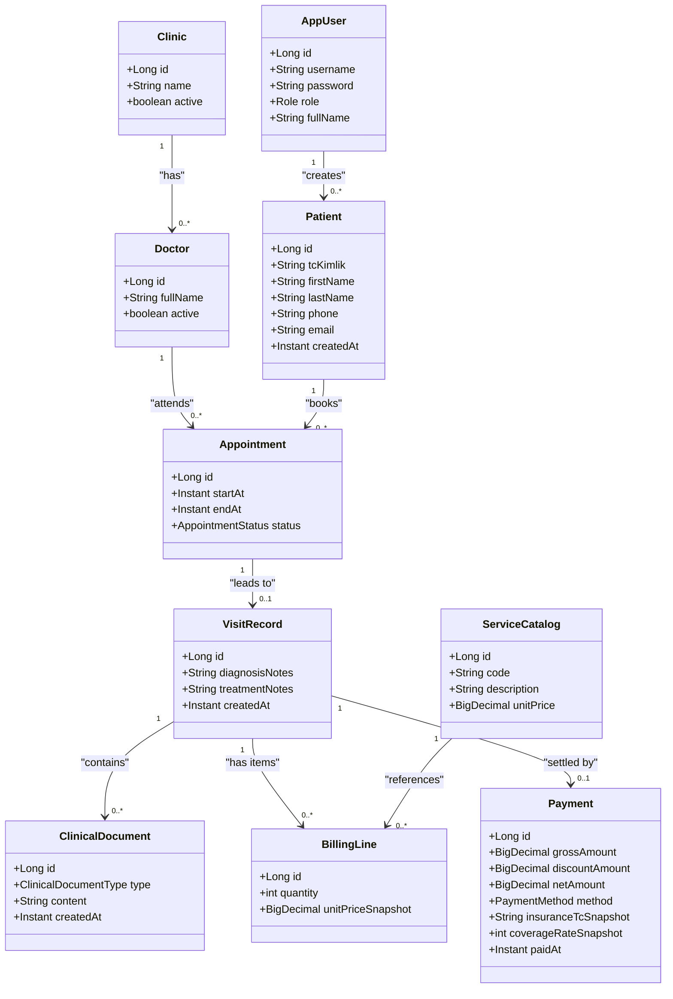
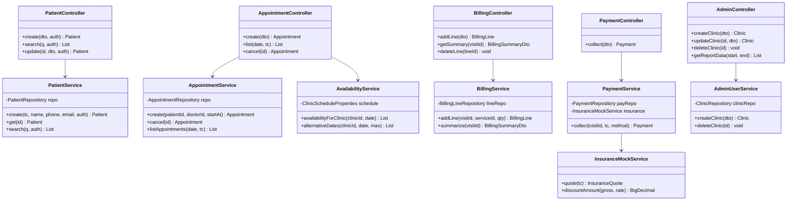
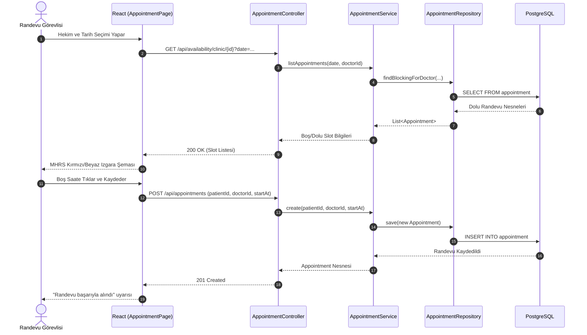
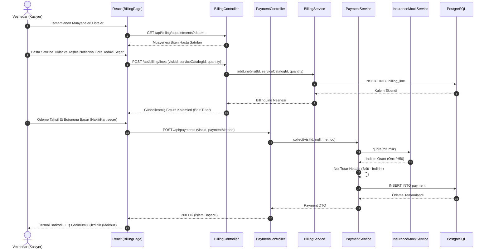
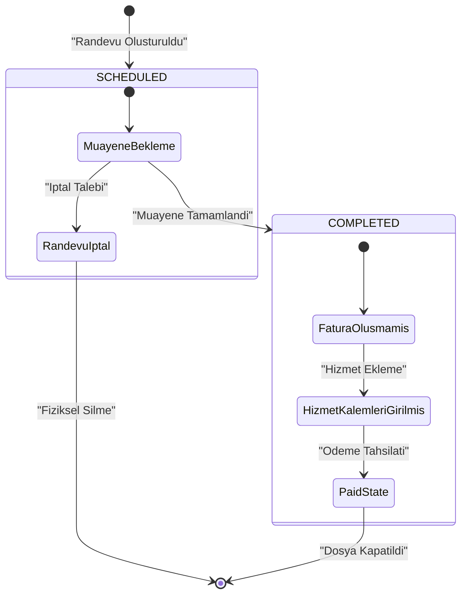

# Şifa Polikliniği Bilgi Sistemi - UML Modelleme ve Tasarım Dokümantasyonu

Bu doküman, Şifa Polikliniği Bilgi Sistemi (ŞPYS) projesinin nesneye yönelik analiz ve tasarım süreçlerinde elde edilen UML (Unified Modeling Language) diyagramlarını, operasyon sözleşmelerini ve sınıf düzeyi izlenebilirlik haritalarını içerir. Diyagramlar Mermaid formatında standartlara uygun olarak çizilmiştir.

---

## 1. Kullanım Senaryosu (Use Case) Modellemesi

Sistemde yer alan 5 dış aktörün (Kayıt Görevlisi, Randevu Görevlisi, Doktor, Veznedar ve Sistem Yöneticisi) sistem sınırları içindeki temel işlevlerle etkileşimi aşağıda şematize edilmiştir.

```mermaid
graph TD
    KG["Kayit Görevlisi"] --> UC1["Hasta Kaydi Olusturma ve Arama"]
    KG --> UC2["Hasta Bilgilerini Guncelleme"]
    
    RG["Randevu Görevlisi"] --> UC3["Randevu Sorgulama ve MHRS Grid Goruntuleme"]
    RG --> UC4["Randevu Alma"]
    RG --> UC5["Randevu Iptal Etme"]
    
    D["Doktor (Hekim)"] --> UC6["Hasta Muayenesi (Tani/Tedavi Notu Girisi)"]
    D --> UC7["Gecmis Muayene Akisi ve Belge Goruntuleme"]
    D --> UC8["Klinik Belge Olusturma (Recete, Rapor vb.)"]
    
    V["Veznedar (Kasiyer)"] --> UC9["Fatura Kalemi Ekleme/Silme ve Hesaplama"]
    V --> UC10["Odeme Tahsilati ve SGK Sigorta Sorgulama"]
    
    A["Sistem Yoneticisi (Admin)"] --> UC11["Kullanici Yonetimi"]
    A --> UC12["Klinik Yonetimi"]
    A --> UC13["Raporlama"]
```



### Kullanım Senaryosu Metinleri ve Operasyon Sözleşmeleri (Use Case Contracts)

#### Operasyon Sözleşmesi 1: Randevu Oluşturma (createAppointment)
*   **Operasyon:** `create(patientId, doctorId, startAt)`
*   **Tasarlayan Sorumlu Sınıf:** `AppointmentService`
*   **Ön Koşullar:**
    1.  T.C. Kimlik numarasına sahip hasta sistemde kayıtlı olmalıdır (`patientRepository.findById(patientId)` mevcut olmalı).
    2.  Hekim sistemde aktif olmalıdır (`doctorRepository.findByIdAndActiveTrue(doctorId)` mevcut olmalı).
    3.  Seçilen zaman dilimi dolu olmamalıdır (belirtilen hekim için o saatte çakışan randevu bulunmamalıdır).
*   **Son Koşullar:**
    1.  Veritabanında `SCHEDULED` (Muayene Bekliyor) durumunda yeni bir `Appointment` nesnesi oluşturuldu ve kaydedildi.
    2.  Randevunun başlangıç (`startAt`) ve bitiş (`endAt` = startAt + 30 dk) zaman damgaları atandı.

#### Operasyon Sözleşmesi 2: Ödeme Tahsilatı (collectPayment)
*   **Operasyon:** `collect(visitId, tcKimlikForInsuranceQuery, method)`
*   **Tasarlayan Sorumlu Sınıf:** `PaymentService`
*   **Ön Koşullar:**
    1.  İlgili muayene ziyareti (`VisitRecord`) mevcut olmalıdır.
    2.  Ziyaret için daha önce ödeme tahsil edilmemiş olmalıdır (`paymentRepository.existsByVisitId(visitId)` false olmalı).
    3.  Faturaya eklenmiş en az bir adet geçerli tedavi/hizmet kalemi (`BillingLine`) bulunmalıdır.
*   **Son Koşullar:**
    1.  `InsuranceMockService.quote` yardımıyla T.C. Kimlik sorgusu yapıldı ve indirim oranı hesaplandı.
    2.  Brüt tutar üzerinden sigorta indirimi düşülerek hastanın ödeyeceği Net Tutar hesaplandı.
    3.  `Payment` nesnesi oluşturulup `method` (CASH veya CARD) bilgisiyle kaydedildi.
    4.  Randevunun mali durumu kapatıldı.

---

## 2. Alan Sınıfı (Domain Class) Diyagramı

Sistemde veri tabanında saklanan nesneleri (Varlıklar/Entities) ve aralarındaki kardinalite ilişkilerini gösteren alan sınıfı diyagramıdır.



---

## 3. Tasarım Sınıf (Design Class) Diyagramı

İş mantığı sınıflarının, denetleyicilerin ve veritabanı erişim arayüzlerinin metot imzalarını ve birbirlerine olan bağımlılık yönlerini gösteren mimari diyagramdır.



---

## 4. Tasarım Sıralama (Sequence) Diyagramları

### A. Randevu Rezervasyonu Akışı
Zaman dilimi sorgusu ve ardından hekime randevu kaydı oluşturulması sırasındaki nesneler arası mesajlaşma akışıdır.



### B. Fatura Kalemi Ekleme ve Ödeme Tahsilatı Akışı
Muayenesi biten hastanın fatura kalemlerinin oluşturulması, sigorta indirimi uygulanması ve nakit/kart tahsilat adımlarıdır.



---

## 5. Durum (State) Diyagramı

Bir Randevu kaydının sisteme girilmesinden faturalandırılıp ödenmesine kadar olan durum geçişlerini gösterir.



---

## 6. Etkinlik (Activity) Diyagramı

Hastanın polikliniğe girişinden işlemlerini tamamlayıp ayrılmasına kadar süren uçtan uca iş akış şemasıdır.

```mermaid
partition "Kayit Birimi"
    activity PatientArrival [Hasta Poliklinige Gelir]
    activity CheckReg [T.C. Kimlik Sorgulaması Yapilir]
    activity CreatePatient [Yeni Hasta Kaydi Yapilir]
end

partition "Randevu Birimi"
    activity ChooseSlot [Tarih ve Hekim MHRS Gridinden Secilir]
    activity SaveAppt [Randevu Kaydedilir]
end

partition "Poliklinik Muayene Birimi"
    activity WaitQueue [Hasta Muayene Sirasini Bekler]
    activity Examine [Hekim Muayene Eder]
    activity WriteNotes [Tani ve Tedavi Notlari Sisteme Girilir]
    activity UploadDoc [Ilac Recetesi veya Rapor Eklenir]
end

partition "Vezne ve Kasa"
    activity AddBillingItems [Veznedar Tedavi Hizmetlerini Secer]
    activity CheckInsurance [SGK/Sigorta Kapsami Sorgulanir]
    activity CollectMoney [Odeme Alinir ve Fatura Kapatilir]
end

%% Akis Baglantilari
graph TD
    Start([Baslangic]) --> PatientArrival
    PatientArrival --> CheckReg
    CheckReg --> IsRegistered{Hasta Kayitli Mi?}
    IsRegistered -- Hayir --> CreatePatient
    CreatePatient --> ChooseSlot
    IsRegistered -- Evet --> ChooseSlot
    ChooseSlot --> SaveAppt
    SaveAppt --> WaitQueue
    WaitQueue --> Examine
    Examine --> WriteNotes
    WriteNotes --> UploadDoc
    UploadDoc --> AddBillingItems
    AddBillingItems --> CheckInsurance
    CheckInsurance --> CalculateTotal[Indirimli Tutar Hesaplanir]
    CalculateTotal --> CollectMoney
    CollectMoney --> End([Hasta Poliklinikten Ayrilir])
```
